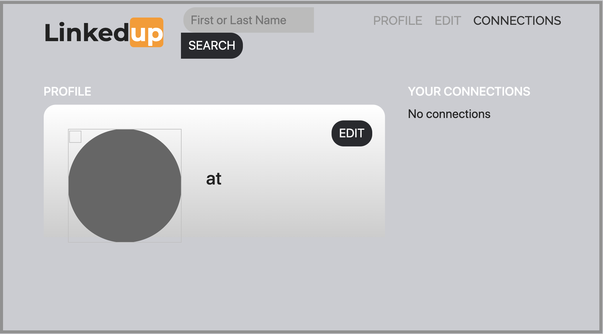
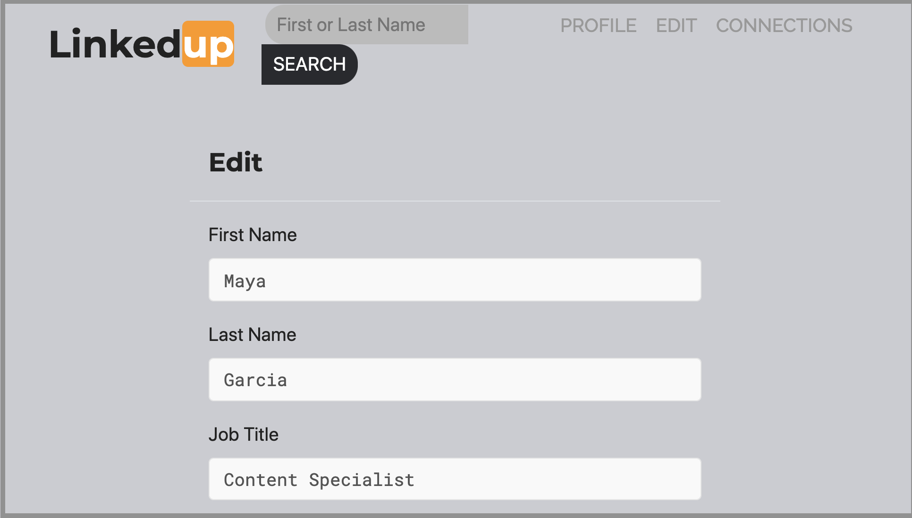
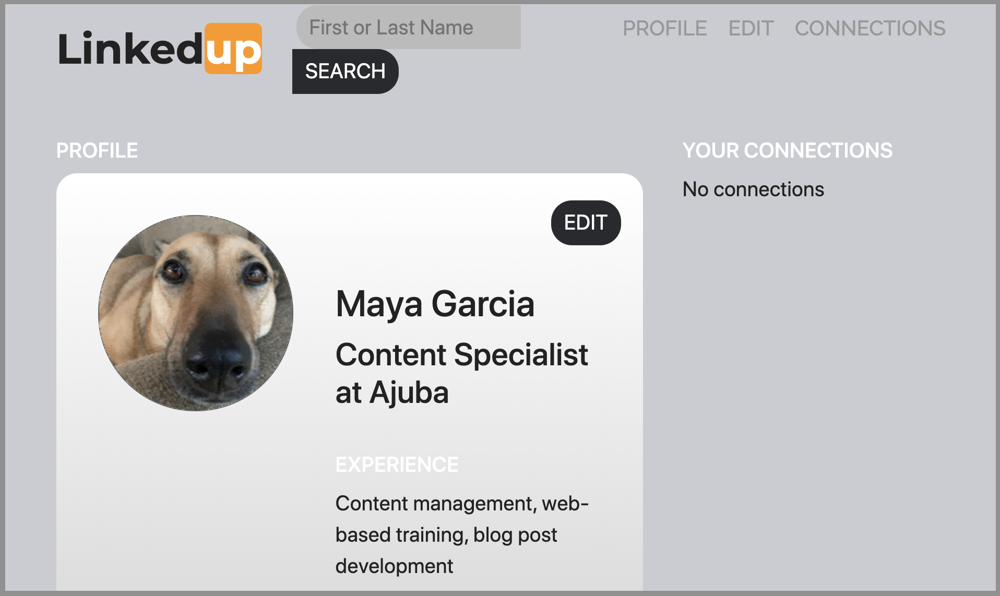
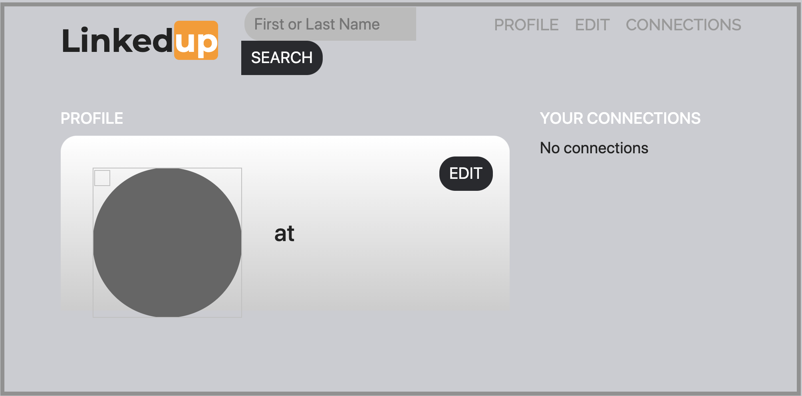
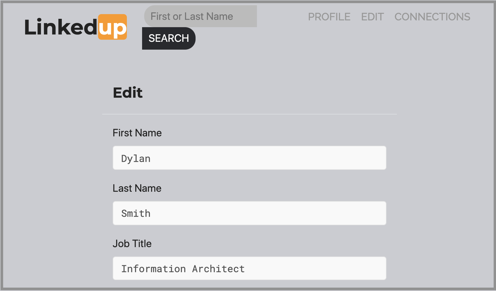
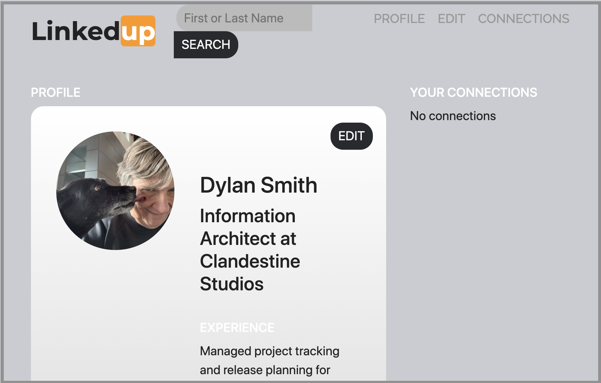
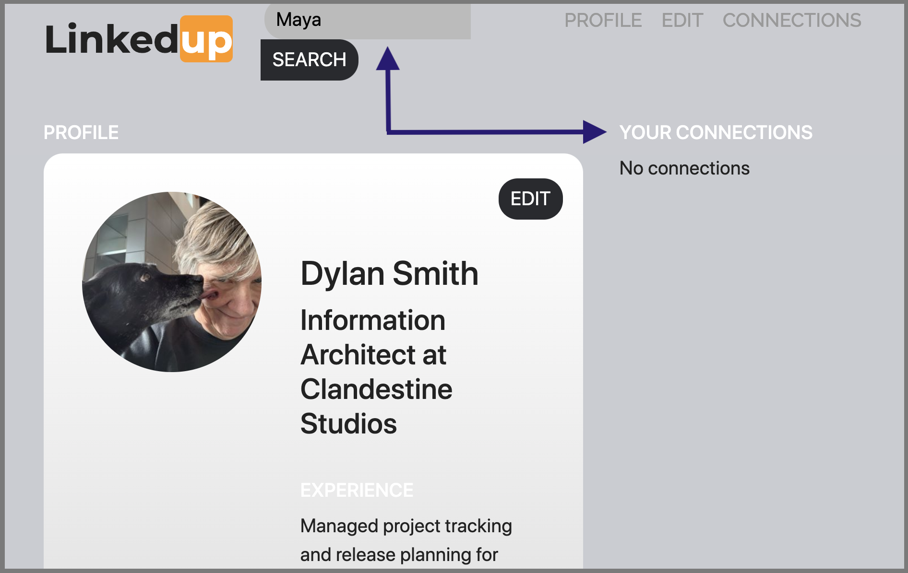
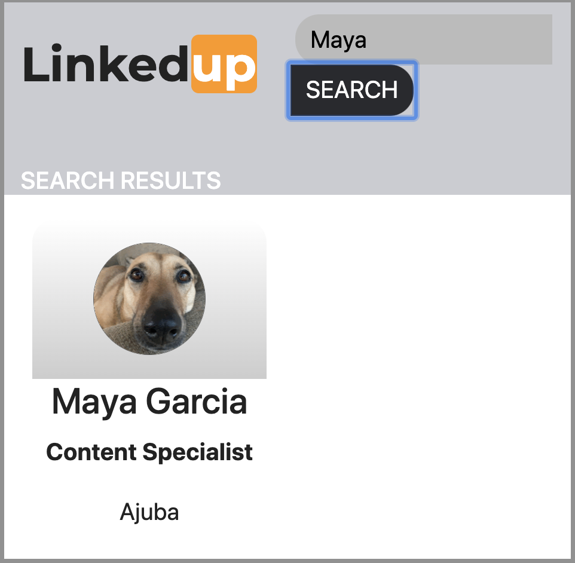
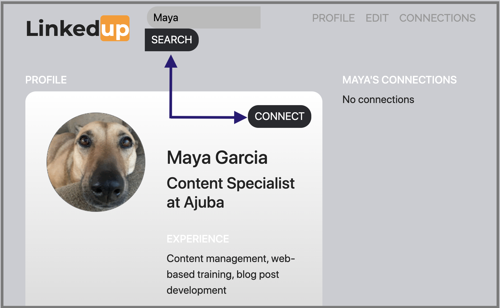
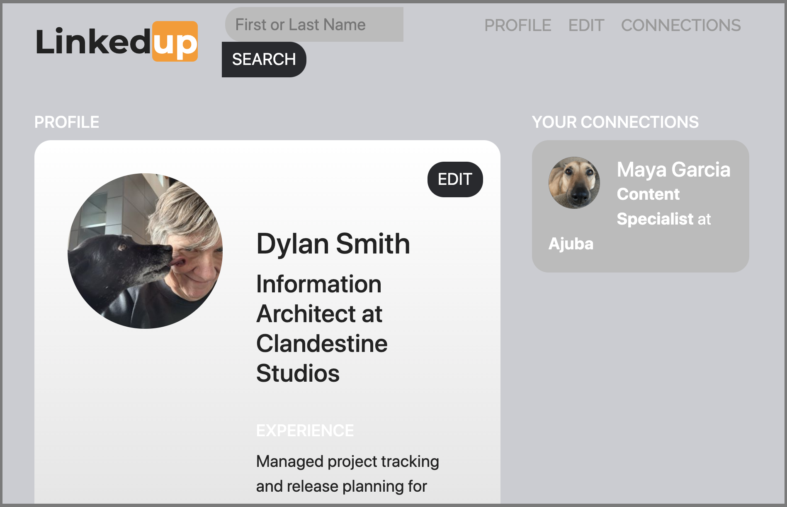

# Make inter-canister calls

One of the most important features of the Internet Computer blockchain for developers is the ability to call functions in one canister from another canister. This capability to make calls between canisters—also sometimes referred to as **inter-canister calls**—enables you to reuse and share functionality in multiple dapps.

For example, you might want to create a dapp for professional networking, organizing community events, or hosting fundraising activities. Each of these dapps might have a social component that enables users to identify social relationships based on some criteria or shared interest, such as friends and family or current and former colleagues.

To address this social component, you might want to create a single canister for storing user relationships then write your professional networking, community organizing, or fundraising application to import and call functions that are defined in the canister for social connections. You could then build additional applications to use the social connections canister or extend the features provided by the social connections canister to make it useful to an even broader community of other developers.

The Motoko-based LinkedUp sample dapp provides a simple implementation of an open professional network that demonstrates how to use inter-canister calls within a project.

The LinkedUp sample dapp is implemented using the following canisters:

-   The `linkedup` canister creates and stores basic profile information for a user, including work experience and educational background.

-   The `connectd` canister creates and stores a user’s connections.

-   The `linkedup_assets` canister stores the front-end assets—including the JavaScript, HTML, and CSS files—that define the user interface

## Before you begin

Before building the sample dapp, verify the following:

-   You have downloaded and installed the SDK package as described in [Download and install](../../quickstart/local-quickstart#download-and-install).

-   You have stopped the local canister execution environment provided by `dfx`.

## Download the demo

To experiment with inter-canister calls using the LinkedUp sample dapp:

1.  Open a terminal shell and change to the folder you are using for your Internet Computer sample projects.

2.  Clone the `linkedup` repository.

        git clone https://github.com/dfinity/linkedup.git

3.  Change to the local working directory for the `linkedup` repository.

        cd linkedup

4.  Install node modules by running the following command:

        npm install

    If necessary, fix any vulnerabilities found by running the following command:

        npm audit fix

5.  Open the `dfx.json` file in a text editor and verify the `dfx` setting has same the version number as the `dfx` executable you have installed.

## Start the local canister execution environment

For development purposes `dfx` provides a local canister execution environment. This requires a `dfx.json` file, so you should be sure you are in the linkedup root directory.

To start the local canister execution environment:

1.  Open a new terminal window or tab on your local computer.

2.  Navigate to the root directory for your project, if necessary.

3.  Start the local canister execution environment by running the following command:

        dfx start --background

    After the local canister execution environment completes its startup operations, you can continue to the next step.

## Register canister identifiers

Once the local canister execution environment is up and running, you can generate unique canister identifiers for your project.

To register canister identifiers:

1.  Check that you are still in your project directory, if needed.

2.  Register unique canister identifiers for the project by running the following command:

        dfx canister create --all

    The command displays the canister identifiers for the canisters defined in the `dfx.json` configuration file.

        "connectd" canister created with canister id: "75hes-oqbaa-aaaaa-aaaaa-aaaaa-aaaaa-aaaaa-q"
        "linkedup" canister created with canister id: "cxeji-wacaa-aaaaa-aaaaa-aaaaa-aaaaa-aaaaa-q"
        "linkedup_assets" canister created with canister id: "7kncf-oidaa-aaaaa-aaaaa-aaaaa-aaaaa-aaaaa-q"

    Keep in mind that because you are running the local canister execution environment, these identifiers are only valid on the local canister execution environment. To deploy canisters on the Internet Computer blockchain mainnet, you must specify the appropriate target using the `--network` command-line option.

## Build and deploy the demo project

To build and deploy the LinkUp sample dapp, take the following steps:

1.  Check that you are still in your project directory by running the `pwd` command, if necessary.

2.  Build the LinkedUp canisters by running the following command:

        dfx build

3.  Deploy the project on the local canister execution environment by running the following command:

        dfx canister install --all

    You should see canister identifiers for the `connectd`, `linkedup` and `linkedup_assets` canisters with a message similar to the following:

        Installing code for canister connectd, with canister_id 75hes-oqbaa-aaaaa-aaaaa-aaaaa-aaaaa-aaaaa-q
        Installing code for canister linkedup, with canister_id cxeji-wacaa-aaaaa-aaaaa-aaaaa-aaaaa-aaaaa-q
        Installing code for canister linkedup_assets, with canister_id 7kncf-oidaa-aaaaa-aaaaa-aaaaa-aaaaa-aaaaa-q

4.  Copy the `linkedup_assets` canister identifier returned by the `dfx canister install` command.

    In this sample dapp, only the `linkedup_assets` canister includes the front-end assets used to access the dapp’s user interface. To open the dapp in a browser, therefore, you need to specify the `linkedup_assets` canister identifier.

5.  Open the `linkedup_assets` canister in your web browser.

    For example, if the local canister execution environment binds to the default localhost address and port number, the URL looks similar to this:

        http://127.0.0.1:8000/?canisterId=7kncf-oidaa-aaaaa-aaaaa-aaaaa-aaaaa-aaaaa-q

## Create a profile and connections

To run through a demonstration of the LinkedUp sample dapp, take the following steps:

1.  Open a browser tab or window.

2.  Type the web server host name, port, and the `canisterId` keyword, then paste the `linkedup_assets` canister identifier as the URL to display.

        127.0.0.1:8000/?canisterId=<ic-identifier-for-linkedup-assets>

    The browser displays an introductory page.

    A public-private key pair will be automatically generated to establish your identity for accessing the canister, so there’s no need to provide a user name and password or register an account to store your identity before using the service.

3.  Click **Login**.

    The browser displays an empty profile page.

    

4.  Click **Edit**, type profile information, copy and paste the image address for an avatar photo, then click **Submit**.

    

    After you click **Submit**, you have a profile with some work history that can be viewed.

    For example:

    

### Add another profile

At this point, there are no other profiles to search for or to add as connections. To try out the Search and Connect features, you can:

-   Run a script that populates the sample dapp with some additional profiles.

-   Create a profile manually by opening a private window.

For this tutorial, you will create another profile manually.

To add a user profile with different identity:

1.  At the top right of the browser window, click the appropriate icon to display the browser’s menu options.

    For example, if you are using Google Chrome, click the vertical ellipse to display the More menu.

2.  Click **New Incognito Window** if you are using Google Chrome or **New Private Window** if you are using Firefox to enable you to navigate to the canister without the user identity generated in your initial browser connection to the canister.

3.  Copy and paste the URL from your first browser session into the private browsing window, then click **Login**.

    

    Notice that there’s no profile in the private browsing window but your original profile is still visible in your initial browser tab.

4.  Click **Edit**, type profile information, copy and paste the image address for an avatar photo, then click **Submit**.

    

    After clicking **Submit**, you have a second profile with some work history that can be viewed.

    For example:

    

5.  Type the first name or last name from the first profile you created—for example, if you created a profile for Maya Garcia, type Maya—then click **Search**.

    

    The profile matching your search criteria is displayed.

    

6.  Select the contact from the search results, wait for the Connect button to be displayed, then click **Connect**.

    

    When the connection request completes, the second profile displays the connection to the first profile. For example:

    

7.  Return to the browser tab with your original profile.

    If you want to create a connection between the original profile and the profile you created in the private browsing window, you can do so by repeating the search, select, and connect steps.

## Explore the configuration file

Now that you have explored the basic features of the sample dapp, you have some context for exploring how the configuration settings and source files are used.

To explore the configuration file:

1.  Change to the `linkedup` directory, then open the project’s `dfx.json` file.

2.  Note that there are two main canisters defined—`connectd` and `linkedup`—each with a `main.mo` source file.

3.  Note that the `linkedup_assets` canister specifies a frontend entry point of `main.js` and assets in the form of CSS and HTML files.

4.  Note that the dapp is configured to use the default IP address and port number for deployment on the local canister execution environment.

## Explore the connectd source code

The source code for the social connections canister, `connectd`, is organized into the following files:

-   The `digraph.mo` file provides the functions to create a directed graph of vertices and edges to describe a user’s connections.

-   The `main.mo` contains the actor and key functions for defining the connections associated with a user profile that can be called by the LinkedUp sample dapp.

-   The `types.mo` file defines the custom type that maps a vertex to a user identity for use in the `digraph` and `main` program files.

## Explore the linkedup source code

The source code for the professional profile with work history and educational background is organized into the following files:

-   The `main.mo` file contains the actor and key functions for the LinkedUp sample dapp.

-   The `types.mo` file defines the custom types that describe the user identity and profile fields that are imported and used in the `main` program file for the `linkedup` canister.

-   The `utils.mo` file provides helper functions.

### Query and update operations

In working with the LinkedUp sample dapp, you might notice that some operations—such as viewing a profile or performing a search—returned results almost immediately. Other operations—such as creating a profile or adding a connection—took a little longer.

These differences in performance illustrate the difference between using query and update calls in the `linkedup` canister.

For example, in the `src/linkedup/main.mo` file, the `create` and `update` functions are update calls that change the state of the canister and therefore need to go through consensus, but the program uses query calls for the `get` and `search` functions to view or search for a profile:

      // Profiles

      public shared(msg) func create(profile: NewProfile): async () {
        directory.createOne(msg.caller, profile);
      };

      public shared(msg) func update(profile: Profile): async () {
        if(Utils.hasAccess(msg.caller, profile)) {
          directory.updateOne(profile.id, profile);
        };
      };

      public query func get(userId: UserId): async Profile {
        Utils.getProfile(directory, userId)
      };

      public query func search(term: Text): async [Profile] {
        directory.findBy(term)
      };

### Interaction between the canisters

In this sample dapp, the `linkedup` canister leverages functions defined in the `connectd` canister. This separation simplifies the code in each canister and, more importantly, illustrates how you can extend a project by calling common functions defined in one canister from one or more other canisters.

To make the public functions defined in one canister available in the another canister:

1.  Add an `import` statement in the calling canister.

    In this example, the public functions are defined in the `connectd` canister and are called by the `linkedup` canister.

    Therefore, the `src/linkedup/main.mo` includes the following code:

        // Make the Connectd app's public methods available locally
        import Connectd "canister:connectd";

2.  Use the `canister.function` syntax to call public methods in the imported canister.

    In this example, the `linkedup` canister calls the `connect` and `getConnections` function in the imported `connectd` canister.

You can see the code that enables interaction between the `linkedup` canister and the `connectd` canister in the `main.mo` source files.

For example, the `src/connectd/main.mo` defines the following functions:

\+

    actor Connectd {
      flexible var graph: Digraph.Digraph = Digraph.Digraph();

      public func healthcheck(): async Bool { true };

      public func connect(userA: Vertex, userB: Vertex): async () {
        graph.addEdge(userA, userB);
      };

      public func getConnections(user: Vertex): async [Vertex] {
        graph.getAdjacent(user)
      };

    };

Because of the `Import` statement, the `connectd` functions are available to the `linkedup` canister and the `src/linkedup/main.mo` includes the following code:

      // Connections

      public shared(msg) func connect(userId: UserId): async () {
        // Call Connectd's public methods without an API
        await Connectd.connect(msg.caller, userId);
      };

      public func getConnections(userId: UserId): async [Profile] {
        let userIds = await Connectd.getConnections(userId);
        directory.findMany(userIds)
      };

      public shared(msg) func isConnected(userId: UserId): async Bool {
        let userIds = await Connectd.getConnections(msg.caller);
        Utils.includes(userId, userIds)
      };

      // User Auth

      public shared query(msg) func getOwnId(): async UserId { msg.caller }

    };

## Stop the local canister execution environment

After you finish experimenting with the `linkedup` dapp, you can stop the local canister execution environment so that it doesn’t continue running in the background.

To stop the local canister execution environment:

1.  In the terminal that displays the output of the local canister execution environment, press Control-C to interrupt the local process.

2.  Stop the local canister execution environment by running the following command:

        dfx stop
