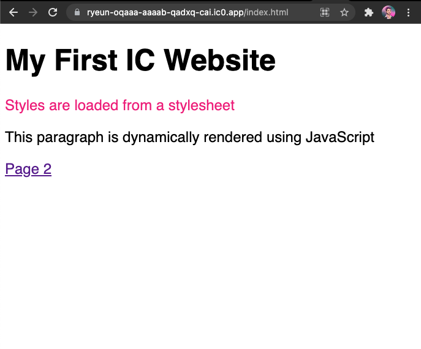

# Hosting a Static Website on the Internet Computer

Before you begin, make sure you are set up with our SDK (DFX) and a Cycles Wallet, either from the [Faucet Quickstart](https://smartcontracts.org/docs/current/developer-docs/quickstart/cycles-faucet) or by purchasing ICP and following our [Network Deployment](https://smartcontracts.org/docs/current/developer-docs/quickstart/network-quickstart) guide.

## Set up your project

Let’s create a simple static website, and then set it up to deploy with dfx.

1.  Create a folder named static-ic-website

2.  In static-ic-website, create a new folder, named assets.

3.  Inside your assets folder, create 4 files

    -   index.html

    -   page-2.html

    -   script.js

    -   style.css

## Add some content

Let’s start with index.html. Paste the following code into your file:

**index.html**

    <!DOCTYPE html>
    <html lang="en">
    <head>
       <meta charset="UTF-8">
       <meta http-equiv="X-UA-Compatible" content="IE=edge">
       <meta name="viewport" content="width=device-width, initial-scale=1.0">
       <title>StaticICWebsite</title>
       <link rel="stylesheet" href="style.css">
    </head>
    <body>
       <h1>My FirstICWebsite</h1>
       
Styles are loaded from a stylesheet

       

       <a href="page-2.html">Page 2</a>
       
    </body>
    </html>

Next, open up page-2.html and add this content.

**page-2.html**

    <!DOCTYPE html>
    <html lang="en">
    <head>
       <meta charset="UTF-8">
       <meta http-equiv="X-UA-Compatible" content="IE=edge">
       <meta name="viewport" content="width=device-width, initial-scale=1.0">
       <title>Page 2</title>
       <link rel="stylesheet" href="style.css">
    </head>
    <body>
       <h1>This is page 2</h1>
       <a href="/">Back to index</a>
    </body>
    </html>

Then, add some simple logic to script.js.

**script.js**

    document.querySelector("#dynamic-content").innerText =
     "This paragraph is dynamically rendered using JavaScript";

And then add some styles to style.css.

**style.css**

    body {
       font-family: sans-serif;
       font-size: 1.5rem;
    }

    p:first-of-type {
       color: #ED1E79;
    }

## Configure DFX to deploy

To host and run this website live on the IC, you will need to configure DFX to upload your files to a certified asset canister. In the root directory of your project, static-ic-website, create a new file, dfx.json. Then, add the following content:

**dfx.json**

    {
       "canisters": {
           "website": {
               "type": "assets",
               "source": ["assets"]
           }
       }
    }

This tells DFX that you want to create an asset canister, and that it should upload the contents of the asset folder. If you want to upload additional static assets, you can add them to the asset folder or add additional folders to the source configuration.

Now, your directory should look something like this:

    ├── assets
    │   ├── index.html
    │   ├── page-2.html
    │   ├── script.js
    │   └── style.css
    └── dfx.json

## Deploy your website

To deploy your website, ensure you are in your terminal at the root of the project, and run this command:

    dfx deploy --network ic

You should see some output in your console, and a success message looking something like this:

    ...

    Uploading assets to asset canister...
    Starting batch.
    Staging contents of new and changed assets:
      /index.html 1/1 (501 bytes)
      /index.html (gzip) 1/1 (317 bytes)
      /page-2.html 1/1 (373 bytes)
      /page-2.html (gzip) 1/1 (258 bytes)
      /script.js 1/1 (117 bytes)
      /style.css 1/1 (102 bytes)
    Committing batch.
    Deployed canisters.

## See your live website

Find your new canister’s ID by running

    dfx canister --network ic id website

Take that canister ID and visit https://&lt;canister-id&gt;.ic0.app, inserting your own canister ID as the subdomain in the URL.

You should see your live, multi-page website, looking like this!

### Next steps

Looking to build a full-stack dapp? Check out the [Full-stack React Tutorial](https://smartcontracts.org/docs/current/developer-docs/build/frontend/custom-frontend)!

Visit our [Developer Forum](https://forum.dfinity.org) for inspiration and support from Dfinity Foundation engineers and the developer community.
