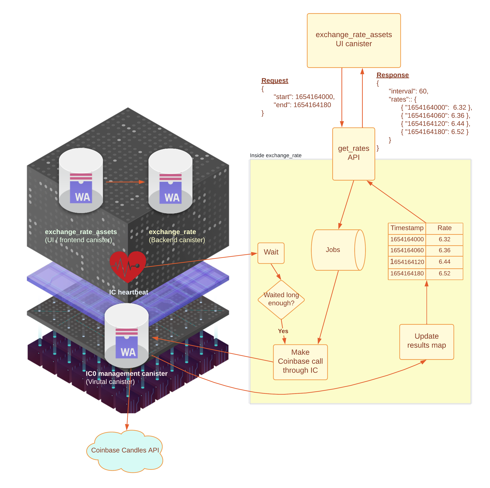

# Using HTTPS Outcalls to Fetch Exchange Rates

## Exchange Rate sample dapp overview

The [HTTPS outcalls](https://wiki.internetcomputer.org/wiki/HTTPS_outcalls) feature provides a way for canisters to directly interact with applications and data that exist outside of the Internet Computer in the Web 2.0 world. This Exchange Rate sample dapp is created to demonstrate simple usage HTTPS outcalls feature. Here are implementations in [Rust](https://github.com/dfinity/examples/tree/master/rust/exchange_rate) and [Motoko](https://github.com/dfinity/examples/tree/master/motoko/exchange_rate).

The sample dapp pulls ICP/USDC exchange rates from a single provider currently – the [Coinbase Pro API](https://api.pro.coinbase.com/products/ICP-USD/candles). The number of data sources can be easily extended as needed for stronger decentralization. For the sample dapp, we are only using a single data source to showcase the feature. A generalization to multiple data sources can easily follow the example given.

## What does the sample dapp do

There are two parts to the sample dapp:
1. the frontend UI canister `exchange_rate_assets`, which includes a time range picker and a rate chart and
2. the backend provider canister `exchange_rate`, which performs the HTTPS outcalls, queues jobs, and processes data.

Upon receiving a request from the user, the request is passed from the frontend to the backend canister for queueing. 
An asynchronous process is triggered at every few Internet Computer heartbeats, to make a Coinbase API request.
To reduce the overall number of remote HTTPS calls needed, each HTTPS request pulls 200 data 
points from Coinbase, which is in the range of the maximum number of data points that Coinbase returns in a single call, spaced at 1 minute each.
As a result, each HTTP request to Coinbase covers 200 minutes of data. The fetched data points are then put into
a timestamp-to-rate hashmap, ready for future user requests to directly read from.

If the time range the user is interested in is longer than a couple of years, the data points to be returned
by the backend `exchange_rate` canister could be too large for the current response limit (2MB).
As a result, we cap the number of data points to be returned by the backend `exchange_rate` canister to
the frontend `exchange_rate_assets` canister, and increase the sampling interval to cover the full requested range.

## How to use the sample dapp

Users should be able to interact only with the frontend UI canister by selecting the start time 
and the end time with the datetime pickers.

The returned rates may not exactly match the user's time selection. (There could be gaps between
data points, or there could be a smaller range being returned, or the returned
dataset precisely matches the user's request.) The reason is that to respect rate limiting
on the remote service, we execute our calls to the remote service once every few IC heartbeats.
Consequently, pulling the rates can be a relatively long asynchronous process. We store all the
previously-pulled rates in memory. As the user submits their requests, the rates that are already
available from previous requests will be returned, while the ones that are not yet available will be
pulled concurrently. If the user spots gaps between requested rates and returned rates, the user
needs to wait for some time and retry the request, and likely the full set of rates will be available then.

## Exchange Rate architecture

## Cost analysis of the `exchange_rate` canister

This `exchange_rate` canister is designed to be as cost-effective as possible. There are 2 major factors
affecting cycle usage when it comes to the Canister HTTPS outcalls feature:
- The number of requests being made
- The size of each request and response

And between these 2 factors, the first one (number of remote requests made) has a strong
effect on cycles cost. Thus, the goal of the canister is to:
- Make as few HTTP outcalls as possible
- Make each remote HTTP outcall as small as possible

However, note that these 2 goals are conflicting with each other. Consider 1 year of exchange rate
data, a static amount of data that needs to be downloaded. If we minimize the number of remote calls we make,
responses will be larger. If we minimize the amount of data each call fetches, the
canister has to make more calls. As we lean towards the first approach, we
increase the amount of data fetched by each call as much as possible to reduce the number of calls needed and the resulting per-call overhead.

On top of that, we store data that's already fetched such that future user requests to this data do not trigger HTTPS outcalls anymore.

## Building and deploying the sample dapp locally
Here are implementations in [Rust](https://github.com/dfinity/examples/tree/master/rust/exchange_rate) and [Motoko](https://github.com/dfinity/examples/tree/master/motoko/exchange_rate). Please refer to the README.md file in each
directory for instrutions on building and local deployment.

