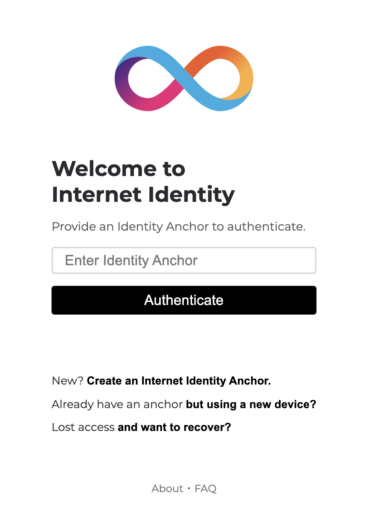
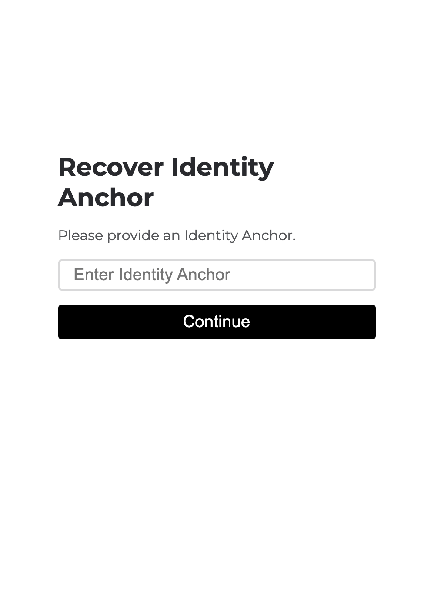
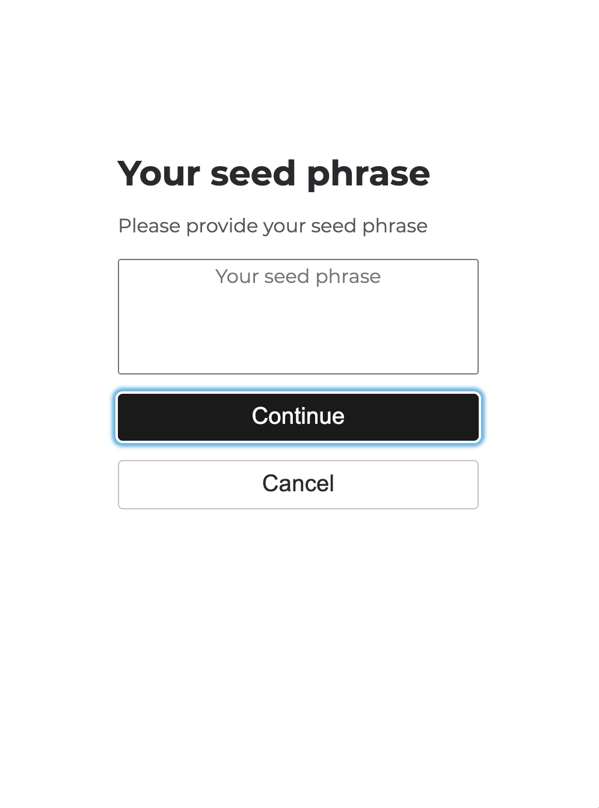

# How to use Internet Identity

If you would like to learn what Internet Identity is, see [What is Internet Identity?](./what-is-ic-identity.md)

If you would like to create an Internet Identity anchor, or manage your devices, go to the [Internet Identity Page](https://identity.ic0.app).

All currently supported authentication methods follow the *WebAuthn* standard. The following restrictions apply, however:

-   On OS X, authentication using Safari is coupled to your browser profile. If you want to authenticate to a dapp in a different browser, or if you use multiple Safari browser profiles, you have to add the combination of your authentication method and the new browser as a new device. See: [`Add a device`](#_add_a_device). Note that on iOS, in contrast to OS X, authentication works across browsers.

-   On OS X and iOS, clearing Safari’s browser history leads to the user’s registered WebAuthn keys being deleted from the secure enclave, and authentication with these keys is no longer possible.

    

    We highly recommend to set up recovery mechanisms so you won’t be locked out of any dapps that require the associated identity. How a recovery mechanism can be set up is described below.

    

-   Firefox does not currently accept OS X with any device authentication method other than a security key.

-   Windows Hello authentication is supported in Chrome, Edge, and Firefox.

## Create an Identity Anchor

You can securely access dapps that run on the Internet Computer and use Internet Identity for authentication, provided you have created an Identity Anchor and added one or more devices to it. Based on the Identity Anchor you provide to Internet Identity for authentication, it will create a different pseudonym for each dapp that you access for you. You can create as many sets of pseudonyms as you want by creating new Identity Anchors.

When you access a dapp, you are directed to Internet Identity and asked to enter an Identity Anchor to authenticate. If you do not have an Identity Anchor, you need to first create one:

1.  Click **Create a new Internet Identity Anchor**.

2.  Enter a name for the authentication method you would like to use to create an Identity Anchor. For example: iPhone, or YubiKey.

3.  Create the Identity Anchor using your device as an authentication method.

    Choose to create the Identity Anchor using either a dedicated security key, or with an authentication method of the device you are using, if that option is available.

    For example, if your device has biometrics enabled to unlock it, you might see the option to use those as your authentication method. You can also use the password that unlocks your computer or a pin that unlocks your phone, depending on the device you’re using.

    

    As a best practice, use at least one dedicated security key per Identity Anchor. You can then add other authentication methods, such as your phone, your computer, or a second security key you actively use. Store the first key in a safe place for the event that you are unable to to use your preferred device. When you use a dedicated security key, you can authenticate to any dapp running on the Internet Computer using any browser, with any device that recognizes it.  
    If you do not have a security key, you can alternatively also generate a key from a seed phrase and add that key as recovery mechanism (see last step below).

    

4.  Authenticate the device.

    Authenticate using the method you selected when prompted.

5.  Click **Confirm**.

    Your Identity Anchor is not created until you perform this step.

    At this point, depending on the device you are using, you might be asked to either use your device authentication method, or to use your security key. If you are registering for the first time, choose to use the device authentication.

6.  Record your Identity Anchor.

    When your device has been added, you’ll receive an Identity Anchor.

    Your Identity Anchor is represented by a unique number. It is not a secret and you should store it in multiple places so you don’t lose it. Your browser will remember your Identity Anchor, but you will need it when you authenticate on a different computer, change your browser profile, or if you clear your browser state.

    

    If you forget your Identity Anchor and are logged out of all devices, you will no longer be able to authenticate with Internet Identity, unless you have set up account recovery using a seed phrase in the next step. So don’t lose your Identity Anchor!

    

7.  Click **Continue**.

8.  Add a recovery mechanism to an Identity Anchor

    In addition to adding multiple devices and using security keys, you can set up account recovery at the prompt by clicking **Add a recovery mechanism to an Identity Anchor**.

    On the next screen, you can select one of the following options:

    -   **Seed Phrase**

        Select this option to generate a cryptographically-secure seed phrase that you can use to recover an Identity Anchor. Make sure you store this phrase somewhere safe and it is known only to you, as anyone who knows the seed phrase will be able to take full control of this Identity Anchor. **Note that the first string in your seed phrase is the Identity Anchor**. You will need this number to begin the recovery process.

        

        You must click the **copy** button and then **continue** or the seed phrase will not be registered.

        

    -   **Security Key**

        Use a dedicated security key to recover an Identity Anchor in the event that you lose access to your authorized devices. This key must be different from the ones you actively use to authenticate to Internet Identity using the given Identity Anchor. Keep this key somewhere safe and ensure it is available only to you. As above, anyone in possession of this security key will be able to take full control of your Identity Anchor. You will need to know the Identity Anchor to begin recovery.

    -   **Set recovery later**

        You can skip adding an account recovery mechanism and choose to set it up later from the Internet Identity landing page.

        

        However, we highly recommend setting up a recovery mechanism so you don’t lose access to this account.

        

9.  Click **Continue**

    On the next screen, you will see your Identity Anchor and your registered authentication methods. From here, you can add and remove authentication methods, and set up additional account recovery methods.

## Add a device

The workflow for adding a device can vary depending on what devices you’ve already added to an Identity Anchor. For example, if you first authorized your computer to create the Identity Anchor, and you’d like to add your phone as a second authentication method, you must be able to authenticate your phone on the authorized computer. You must always be able to authorize the device you want to add by using a device that is already authorized.

If you start the add device flow on a Windows device that supports Windows Hello authentication, the browser first asks you to add Windows Hello as the new authentication method. If you have registered the device with Windows Hello already and would like to add e.g. a security key instead, you need to cancel the Windows Hello prompt. Then the browser lets you choose a different authentication method, such as a security key.

If you are adding a new device, such as a new security key, or a new browser profile using a computer or phone that has already been added as an authentication method, you can do this easily and directly from within Internet Identity Management.

Other workflows can be more complex. For example, to add your phone’s unlock methods as an additional authentication method using your authenticated computer, proceed as follows:

1.  On your computer: Open the Internet Identity web page and log in.

2.  On your computer: Click **add new device**

3.  On your computer: choose **remote device**

    -   This enables the device registration mode for this identity anchor. The subsequent steps need to be completed within 15 minutes.

4.  On your phone: click **Already have an anchor but using a new device?**

5.  On your phone: enter your identity anchor

6.  On your phone: enter a device alias

    -   After completing this step a verification code will be shown

7.  On your computer: enter the device verification code

Any device added this way will have **full control over your identity**. Only add devices that you *personally own*.

You should add as many devices as possible to prevent you from losing access to dapps in case you lose a device. Again, the best way to deal with accidental loss is to set up a recovery method. Also, make sure to keep all added authentication methods safe and do not lose them, as a single authentication method gives access to the Identity Anchor.

If you lose a device, remove it from the authentication methods immediately and make sure that all added authentication methods are in your control, as an attacker may have added more methods in the meanwhile. Also, consider the Identity Anchor compromised starting from the time the device was lost until it was removed from the authentication methods.

## How to recover a lost identity

When you create an Identity Anchor, you will be prompted to copy a seed phrase or to add a dedicated security key as recovery mechanism.

You can choose to do this at any time, but note that if you lose an Identity Anchor or if you no longer have access to authorized devices, you will need the seed phrase or the recovery security key to recover the Identity Anchor. Without one of these, you will be locked out of any dapps that require the associated identity.

If you have set up a recovery phrase or recovery security key for an Identity Anchor, you can regain access by following these steps:

**1. Click **Lost access and want to recover?** from the Internet Identity landing page.**

**2. Input your identity anchor**

**3. Input your seed phrase**

## How to connect your anchor to identity.internetcomputer.org using a trusted device

:::note This flow requires that you can access https://identity.ic0.app. If you cannot connect to https://identity.ic0.app you will need to [use your recovery phrase](#migrate-recovery-phrase).

1. Visit https://identity.internetcomputer.org with your browser.
2. Select "Manage existing" or "More options".
3. Select “Add a new device?” and follow the instructions shown on the screen on any device where you have access to https://identity.ic0.app. It can also be the same device.

## How to recover your anchor on identity.internetcomputer.org using a recovery phrase {#migrate-recovery-phrase}

:::note This flow requires a recovery phrase. If you have not done so already, go to https://identity.ic0.app and add one by authenticating and selecting "Add recovery method" on the anchor management page.

1. Visit https://identity.internetcomputer.org with your browser.
2. Select "Manage existing" or "More options".
3. Select "Lost Access?"
4. Enter your recovery phrase
5. Add the current device to your anchor by selecting
  1. Add new device
  2. Hardware

:::caution Recovery devices (External Hardware) added on https://identity.ic0.app will not work on https://identity.internetcomputer.org!

